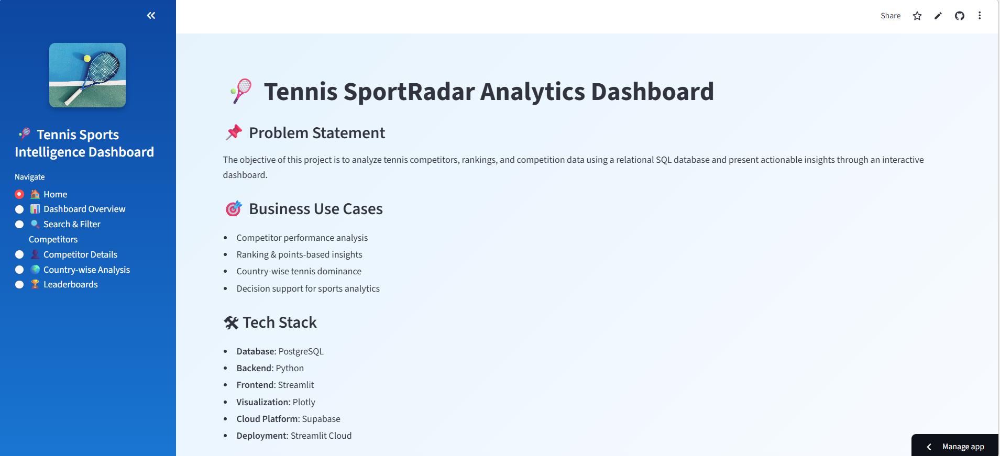
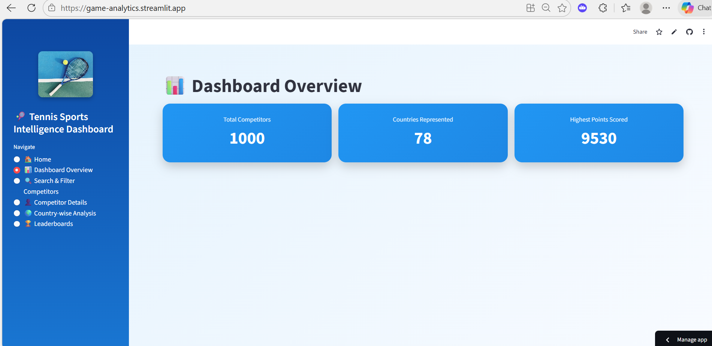
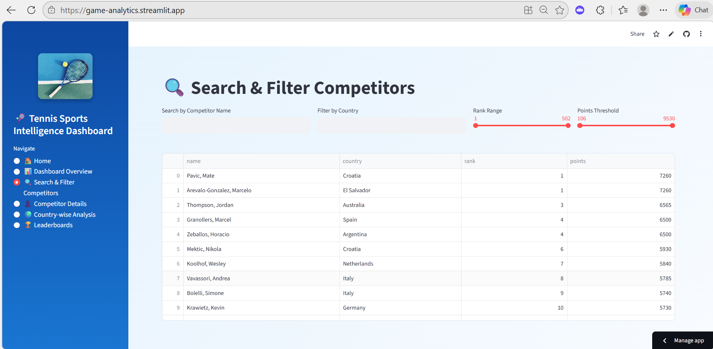
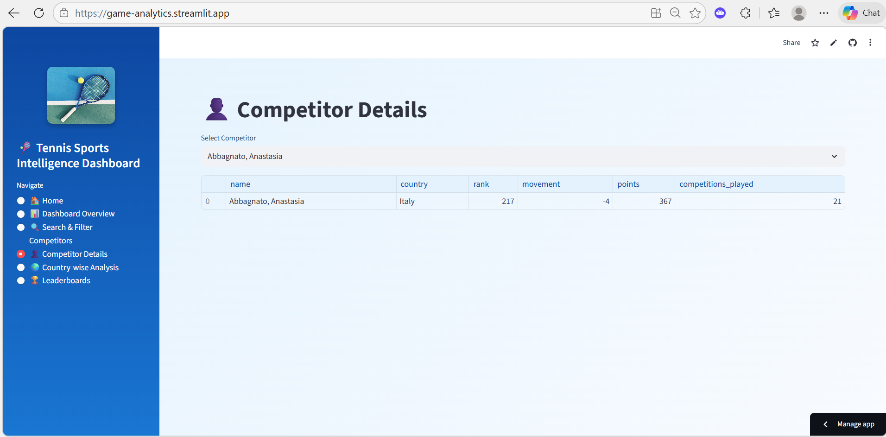
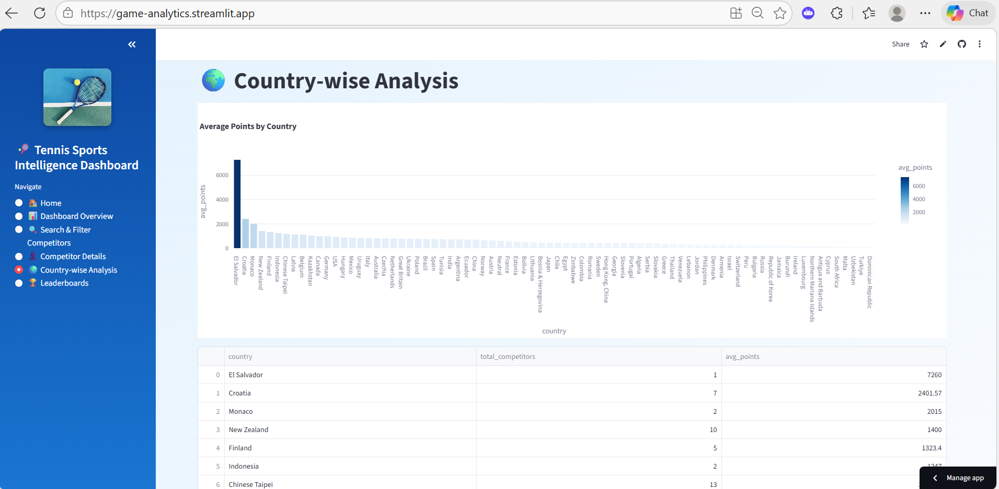
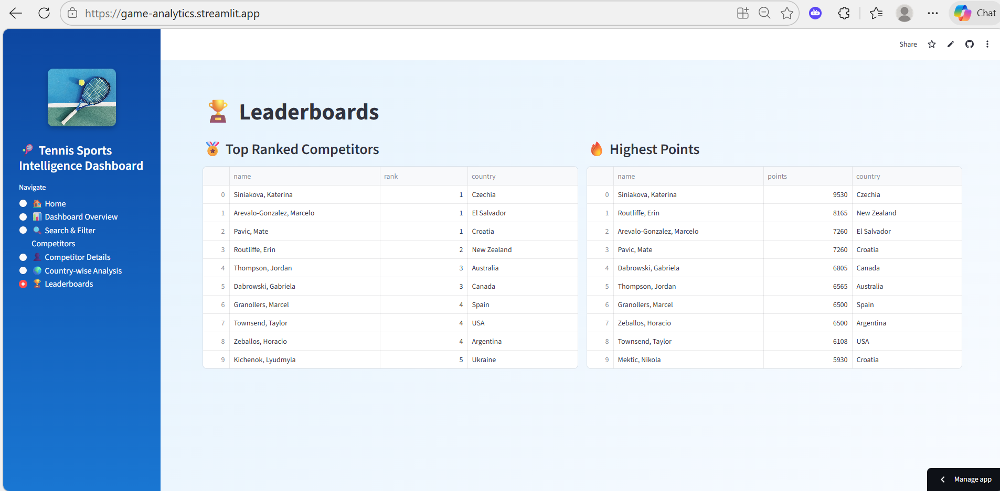

# 🎾 Game Analytics: Unlocking Tennis Data with SportRadar API

An end-to-end **Sports Analytics Dashboard** built using **Python, SQL, Streamlit, and the SportRadar API** to analyze tennis competitor rankings, performance trends, and country-wise insights through an interactive web application.

---

## 📌 Project Overview

The **SportRadar Tennis Analytics Dashboard** is designed to extract, transform, store, and visualize tennis competition and competitor ranking data.  
It enables sports analysts, enthusiasts, and organizations to explore **rankings, points, country dominance, and competitor performance** using an intuitive Streamlit-based interface.

---

## 🧩 Problem Statement

The objective of this project is to analyze tennis competitors, rankings, and competition data using a relational SQL database and present actionable insights through an interactive dashboard.

The application:
- Extracts tennis data from the **SportRadar API**
- Transforms nested JSON into structured relational tables
- Stores data in a **PostgreSQL** database
- Provides real-time analytics via **Streamlit dashboards**

---

## 🎯 Business Use Cases

- **Competitor Performance Analysis**
- **Ranking & Points-Based Insights**
- **Country-wise Tennis Dominance**
- **Decision Support for Sports Analytics Teams**
- **Interactive Exploration of Player Rankings**

---

## 🛠️ Tech Stack

| Layer | Technology |
|------|-----------|
| Programming Language | Python |
| Database | PostgreSQL |
| Backend | Python |
| Frontend | Streamlit |
| Visualization | Plotly |
| API | SportRadar Tennis API |
| Cloud Platform | Supabase |
| Deployment | Streamlit Cloud |

---

## 🧱 Database Design

### Key Tables

- **Competitors**
- **Competitor_Rankings**
- **Categories**
- **Competitions**
- **Complexes**
- **Venues**

Relational schema ensures:
- Normalized structure
- Efficient querying
- Accurate ranking and country-based analysis

---

## 🔄 Data Pipeline Workflow

1. **Data Extraction**
   - Fetch tennis competitions, competitors, and rankings via SportRadar API
2. **Data Transformation**
   - Parse nested JSON into tabular format
3. **Data Storage**
   - Store cleaned data in PostgreSQL
4. **Data Analysis**
   - Execute optimized SQL queries
5. **Data Visualization**
   - Display insights using Streamlit & Plotly

---

## 🖥️ Application Features

### 🏠 Home Dashboard
- Total number of competitors
- Countries represented
- Highest points scored



---

### 📊 Dashboard Overview
- Quick KPI view of the entire dataset



---

### 🔍 Search & Filter Competitors
- Search competitors by name
- Filter by:
  - Country
  - Rank range
  - Points threshold



---

### 👤 Competitor Details
- View detailed information of a selected competitor:
  - Rank
  - Movement
  - Points
  - Competitions played
  - Country



---

### 🌍 Country-wise Analysis
- Average points by country
- Total competitors per country
- Country dominance insights



---

### 🏆 Leaderboards
- Top-ranked competitors
- Competitors with highest points



---

## 📊 Sample SQL Insights

- Top-ranked competitors
- Highest points scorers
- Competitors per country
- Countries with highest average points
- Stable ranking competitors

---

## ⚙️ Installation & Setup

### 1️⃣ Clone the Repository
```bash
git clone https://github.com/your-username/Game-Analytics-Unlocking-Tennis-Data-with-SportRadar-API.git
cd Game-Analytics-Unlocking-Tennis-Data-with-SportRadar-API
